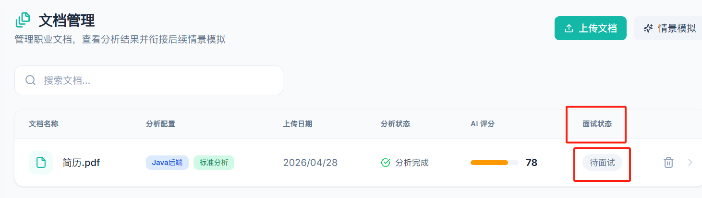
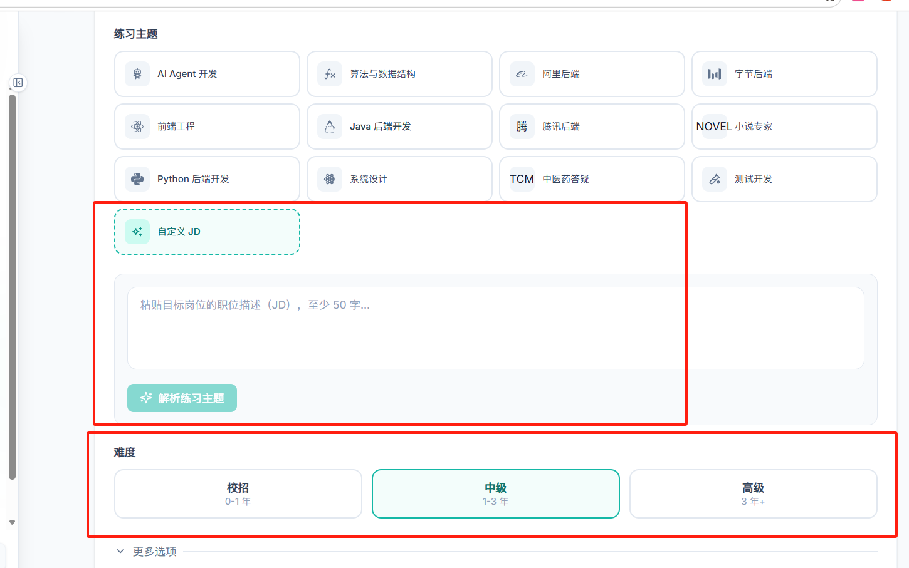

## 文档解析(已解决)

**/documents**

字段`面试状态`不合理, 应该是模拟状态, 且相应的值应该类似于待模拟

## 情景模拟(已解决)

### 开始前

**/simulation**

- `练习主题`应该改为`岗位选择`
- 在自定义JD那里有逻辑问题, 不写东西(并且必须点击`解析练习主题`, 解析出来的东西没用啊, 无法选中)无法进行模拟, 写了相关岗位描述但是必须要5个字(不合理)
- 难度选择有问题, 跟校招/中级/高级没关系, 应该是针对三个情景方向来设置的难度类型, 如新手/普通/老油条

### 进行时

- 同样岗位/难度下题目可能相同, 不科学
- 开启模拟后, 根据情景方向的不同(求职面试/专业答疑/职业沟通表达), ai担任的角色应该显示不同, 不应该全部显示为面试官
  - 求职时ai应该是面试官
  - 答疑时ai应该是提问者
  - 职业沟通时ai应该是同事或者相关岗位职员(程序员对应有项目经理/前端同事, 小说专家应该对应策划编辑/读者)
- **模拟出的问题情况**:
  - 问题难度与情况应该严格贴近难度与岗位与情景方向的选择, 求职时就应该问针对应聘人的问题, 职业沟通表达应该问符合ai角色的问题(产品经理就应该问程序员跟小组会议/项目进度相关的问题)
  - 对应prompts与skills的匹配, 选择的难度与岗位与情景方向应该匹配对应的提示词与技能, 没找到就用通用的

## 问答助手(已解决)

**/knowledgebase/chat**

- 必须勾选知识库才可以进提问, 不清楚该逻辑是否正确
- 问到知识库没有的信息会提示找不到(不会进行自主思考+联网搜索), 不清楚逻辑是否正确

## 注意

这些问题可能涉及到:
- 前端的文件(什么都可能)
- 后端的领域模型(字段可能要增删改)
- [resources](..%2Fsrc%2Fmain%2Fresources)下的prompts与skills情况, 可能是内容不对或者没有被匹配到, 需要进行整体的检查与优化, 严格贴近当前架构
